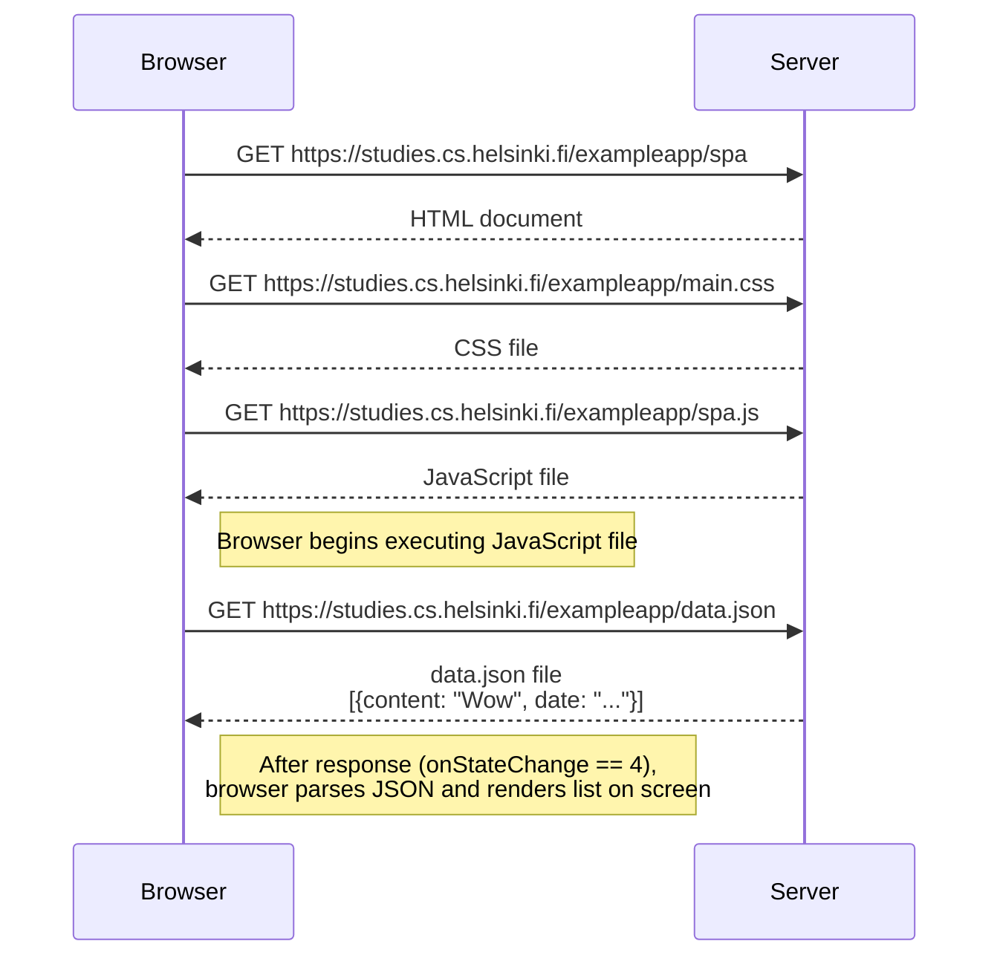
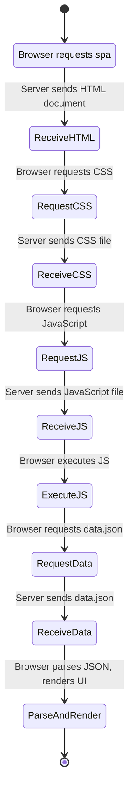

# Exercise 0.4 - Fullstackopen
## Challenge
Create a diagram depicting the situation where the user goes to the single-page app version 
of the notes app at https://studies.cs.helsinki.fi/exampleapp/spa.

## Chain of events when we open the application
participants: Browser and Server
- Browser sent GET request to https://studies.cs.helsinki.fi/exampleapp/spa to server
- Server sent HTML document to broswer

- Broswer sent GET request  https://studies.cs.helsinki.fi/exampleapp/main.css to server
- server sent the css file to browser

- Browser sent GET request https://studies.cs.helsinki.fi/exampleapp/spa.js to server
- server sent javascript file to browser

notes - browser begins executing the javascript file it fetched

- Browser sent GET request https://studies.cs.helsinki.fi/exampleapp/data.json to server
- Server sent data.json file to browser : [{content: "Wow", date: "2025-07-14T08:42:17.170Z"},…]

note: onStateChange == 4, that is after response is recieved browser parses json file and renders the data onto screen as an unordered list

