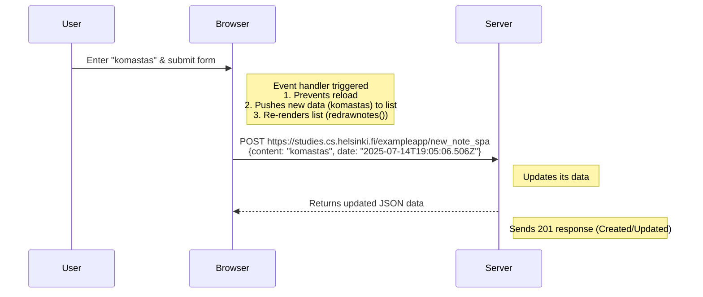
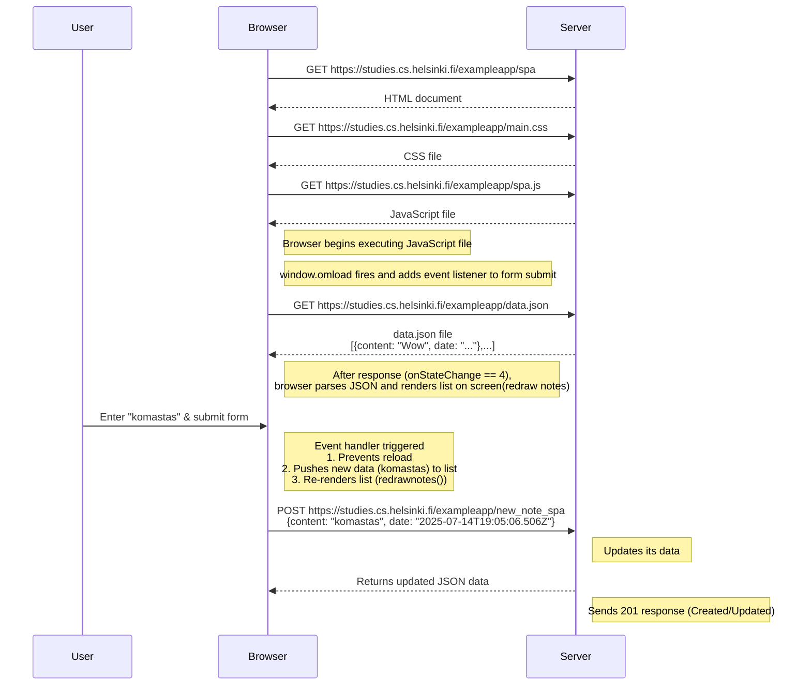

# Exercise 0.6 - Fullstackopen
## Challenge
Create a diagram depicting the situation where the user creates a new note using the single-page version of the app.

## Chain of events when user enters the data
participants: User, browser, server
- user enters some data "komastas" and submits the form
note at browser: event handler function is called. 1. Its stops browser reload, 2. A new data is pushed to the data list  is and list is re-rendered (redrawnotes())
- Browser sends POST request to https://studies.cs.helsinki.fi/exampleapp/new_note_spa with {content: "komastas", date: "2025-07-14T19:05:06.506Z"} server
note at server: updates server its data
- Server sends new json file to browser letting it know that it updated the data
notes at server: sends 201 reponse meaning data is created or updated

### chain of events after entering input

## All events 
