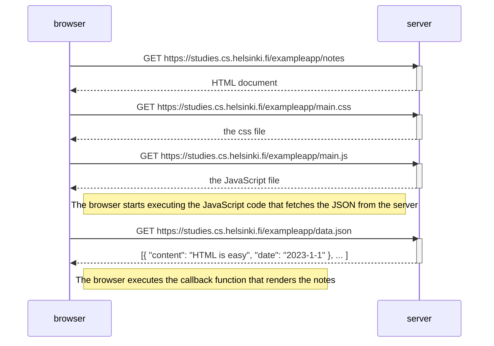

# Exercise 0.4 - Fullstackopen
## Challenge
- Create a diagram depicting the situation where the user creates a new note on the page https://studies.cs.helsinki.fi/exampleapp/notes by writing something into the text field and clicking the Save button.
- If necessary, show operations on the browser or on the server as comments on the diagram.

## Approach
- We are working on the following example [notes](https://studies.cs.helsinki.fi/exampleapp/notes).
- Below are the chain of events caused by opening the page.

- we need to create diagram for chain of events happening when the user creates a new note on the page [notes]( https://studies.cs.helsinki.fi/exampleapp/notes) by writing something into the text field and clicking the Save button.

### chain of events after entering input
1. on Button Click => Browser --> server : POST Request to /exampleapp/new_note 
    - browser sent information to server.
2. server sends HTTP status 302, which suggests redirect

```mermaid
sequenceDiagram
  actor A1 as New Actor
  participant browser as browser
  participant server as server
  
  A1 ->> browser: <input> and click save
  browser ->>+ server: POST https://studies.cs.helsinki.fi/exampleapp/notes payload: <input>
  Note left of server: Server updates its data
  Note right of browser: Browser Reloads the page
  server -->- browser: Status code 302 (meaning URL re-direct)
  browser ->>+ server: GET https://studies.cs.helsinki.fi/exampleapp/notes
  server -->>- browser: HTML document
  browser ->>+ server: GET https://studies.cs.helsinki.fi/exampleapp/main.css
  server -->>- browser: the css file
  browser ->>+ server: GET https://studies.cs.helsinki.fi/exampleapp/main.js
  server -->>- browser: the JavaScript file
  Note right of browser: The browser starts executing the JavaScript code that fetches the JSON from the server
  browser ->>+ server: GET https://studies.cs.helsinki.fi/exampleapp/data.json
  server -->>- browser: [{ "content": "HTML is easy", "date": "2023-1-1" }, ..{"content":{Input from user}, "date":{date}} ]
  Note right of browser: The browser executes the callback function that renders the notes
```

### All events

```mermaid
sequenceDiagram
  actor A1 as New Actor
  participant browser as browser
  participant server as server

  browser ->>+ server: GET https://studies.cs.helsinki.fi/exampleapp/notes
  server -->>- browser: HTML document
  browser ->>+ server: GET https://studies.cs.helsinki.fi/exampleapp/main.css
  server -->>- browser: the css file
  browser ->>+ server: GET https://studies.cs.helsinki.fi/exampleapp/main.js
  server -->>- browser: the JavaScript file
  Note right of browser: The browser starts executing the JavaScript code that fetches the JSON from the server
  browser ->>+ server: GET https://studies.cs.helsinki.fi/exampleapp/data.json
  server -->>- browser: [{ "content": "HTML is easy", "date": "2023-1-1" }, ... ]
  Note right of browser: The browser executes the callback function that renders the notes
  
  A1 ->> browser: <input> and click save
  browser ->>+ server: POST https://studies.cs.helsinki.fi/exampleapp/notes payload: <input>
  Note left of server: Server updates its data
  Note right of browser: Browser Reloads the page
  server -->- browser: Status code 302 (meaning URL re-direct)
  browser ->>+ server: GET https://studies.cs.helsinki.fi/exampleapp/notes
  server -->>- browser: HTML document
  browser ->>+ server: GET https://studies.cs.helsinki.fi/exampleapp/main.css
  server -->>- browser: the css file
  browser ->>+ server: GET https://studies.cs.helsinki.fi/exampleapp/main.js
  server -->>- browser: the JavaScript file
  Note right of browser: The browser starts executing the JavaScript code that fetches the JSON from the server
  browser ->>+ server: GET https://studies.cs.helsinki.fi/exampleapp/data.json
  server -->>- browser: [{ "content": "HTML is easy", "date": "2023-1-1" }, ..{"content":{Input from user}, "date":{date}} ]
  Note right of browser: The browser executes the callback function that renders the notes
```

